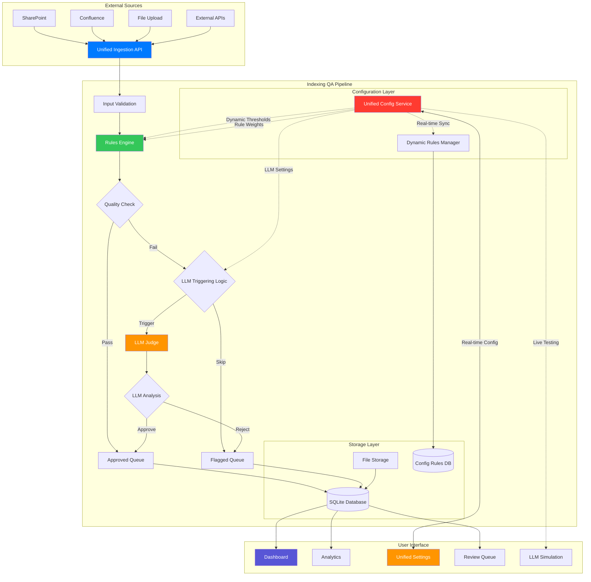

# 🧠 Indexing QA Pipeline

<div align="center">

[](https://docker.com)
[](https://fastapi.tiangolo.com)
[](https://nextjs.org)
[](https://python.org)
[](LICENSE)

**AI-Powered Quality Assurance Pipeline for Knowledge Base Content**

*Intelligent content validation with dynamic LLM triggering, comprehensive rules engine, and real-time analytics*

[🚀 Quick Start](#-quick-start) •
[📖 Documentation](#-documentation) •
[🏗️ Architecture](#️-architecture) •
[🐳 Docker Setup](#-docker-deployment) •
[🛠️ Development](#️-development-setup)

</div>

---

## 📖 Overview

The **Indexing QA Pipeline** is a comprehensive, enterprise-ready quality assurance system designed to validate, analyze, and optimize knowledge base content using advanced AI techniques. It combines rule-based validation with intelligent LLM integration to ensure high-quality content ingestion at scale.

### 🎯 Key Features

- **🤖 Intelligent LLM Integration**: Smart triggering based on quality thresholds with OpenAI and Anthropic support
- **⚙️ Unified Configuration Service**: Single source of truth for all thresholds, weights, and settings with real-time updates
- **📊 Comprehensive Analytics**: Real-time dashboards with advanced filtering and visualization
- **⚡ High-Performance Processing**: Async processing with unified bulk ingestion endpoints
- **🔍 Multi-Dimensional Quality Analysis**: 11-point quality assessment framework
- **🛡️ Advanced Rules Engine**: Customizable validation rules with dynamic thresholds and weights
- **🔄 Dynamic Configuration Management**: No hardcoded values - everything configurable via frontend
- **📈 Real-Time Monitoring**: Live metrics, health checks, and performance tracking
- **🔄 Unified Ingestion API**: Single endpoint supporting multiple input formats
- **🎨 Modern UI**: Apple-inspired, enterprise-ready frontend interface
- **🎯 LLM Decision Simulation**: Test LLM behavior with real-time threshold simulation

---

## 🏗️ Architecture

### System Overview



### Data Flow Architecture

```mermaid
sequenceDiagram
    participant Client as Frontend Client
    participant API as FastAPI Backend
    participant Rules as Rules Engine
    participant LLM as LLM Judge
    participant DB as Database
    
    Client->>API: Submit Content
    API->>API: Input Validation
    API->>Rules: Quality Analysis
    Rules->>Rules: 11-Dimension Check
    
    alt Quality Score ≥ Threshold
        Rules->>DB: Store as Approved
        Rules->>API: Return Success
    else Quality Score < Threshold
        Rules->>API: Trigger LLM Analysis
        API->>LLM: Send for Review
        LLM->>LLM: AI Analysis
        alt LLM Approves
            LLM->>DB: Store as Approved
        else LLM Rejects
            LLM->>DB: Store as Flagged
        end
        LLM->>API: Return Decision
    end
    
    API->>Client: Response with Status
    
    Note over Client,DB: Real-time updates via WebSocket
```



### Component Architecture


---

## 🧠 Quality Assessment Framework

### 11-Dimensional Quality Analysis

Our comprehensive quality framework evaluates content across multiple dimensions:

| Dimension | Description | Weight | Threshold |
|-----------|-------------|---------|-----------|
| **Content Length** | Validates minimum content requirements | 10% | > 50 chars |
| **Semantic Relevance** | Tags alignment with content | 15% | > 0.15 |
| **Domain Relevance** | Content relevance to domain | 10% | > 0.1 |
| **Context Coherence** | Logical content structure | 10% | > 0.1 |
| **Tag Specificity** | Avoids generic tags | 15% | > 0.8 |
| **Content Quality** | Overall content assessment | 20% | Dynamic |
| **Metadata Completeness** | Required fields validation | 5% | 100% |
| **Format Compliance** | Structure and formatting | 5% | Pass/Fail |
| **Duplicate Detection** | Content uniqueness | 5% | < 0.85 similarity |
| **Language Quality** | Grammar and readability | 3% | Dynamic |
| **Source Reliability** | Connector trust score | 2% | > 0.7 |

### LLM Triggering Logic

```python
def should_trigger_llm(quality_score, mode, thresholds):
    """
    Smart LLM triggering with real-time Unified Config integration
    
    Modes:
    - percentage: Trigger for records below X% threshold
    - weighted: Trigger based on weighted rule scores  
    - range: Trigger for records in gray zone (min-max range)
    - threshold: Trigger below fixed threshold (legacy)
    
    Features:
    - Real-time threshold updates via Unified Config Service
    - Frontend simulation testing with live configuration
    - No hardcoded values - everything dynamically configurable
    - Bidirectional sync between config systems
    """
    # Get current dynamic thresholds from Unified Config
    from unified_config_service import get_unified_config_service
    config = get_unified_config_service()
    
    if mode == "percentage":
        threshold = config.get_threshold("llm_percentage_threshold")
        return quality_score < threshold
    elif mode == "weighted":
        threshold = config.get_threshold("llm_weighted_threshold") 
        weighted_score = calculate_weighted_score(quality_score, config.get_rule_weights())
        return weighted_score < threshold
    elif mode == "range":
        min_threshold = config.get_threshold("llm_range_min_threshold")
        max_threshold = config.get_threshold("llm_range_max_threshold")
        return min_threshold <= quality_score <= max_threshold
    elif mode == "threshold":
        threshold = config.get_threshold("llm_fixed_threshold")
        return quality_score < threshold
```

### Dynamic Configuration Architecture

The **Unified Config Service** serves as the single source of truth for all system configuration:

- **🔄 Real-time Updates**: Changes via frontend instantly affect processing
- **🎯 No Hardcoded Values**: Everything configurable from UI
- **⚖️ Rule Weight Management**: Dynamic rule importance scoring
- **🔧 Threshold Synchronization**: Bidirectional sync between config systems
- **🧪 Live Simulation**: Test LLM behavior with current settings
- **📊 Frontend Integration**: Complete settings management interface

---

## 🚀 Quick Start

### 🐳 Docker Deployment (Recommended)

**One-command setup for instant deployment:**

```bash
# Clone the repository
git clone <repository-url>
cd indexing-qa-main

# Start the entire pipeline
docker-compose up --build

# Or run in background
docker-compose up --build -d
```

**That's it!** 🎉 The application will be running with:
- ✅ Full-stack application (Frontend + Backend)
- ✅ Database automatically initialized
- ✅ All dependencies installed
- ✅ Production-ready configuration

### 🌐 Access Points

| Service | URL | Description |
|---------|-----|-------------|
| 🖥️ **Frontend** | http://localhost:3000 | Main application interface |
| 🔧 **Backend API** | http://localhost:8000 | FastAPI backend service |
| 📚 **API Docs** | http://localhost:8000/docs | Interactive API documentation |
| ❤️ **Health Check** | http://localhost:8000/health | System health status |
| ⚙️ **Unified Settings** | http://localhost:3000/settings | Complete configuration management interface |
| 🎯 **LLM Simulation** | http://localhost:3000/settings (Simulation tab) | Real-time LLM behavior testing |
| 📊 **Analytics** | http://localhost:3000/analytics | Advanced analytics dashboard |
| 🔍 **Review Queue** | http://localhost:3000/issues | Manual review interface |
| 📁 **Records** | http://localhost:3000/records | Processed content browser |

---

## 🛠️ Development Setup

### Prerequisites

- **Python 3.11+** with pip
- **Node.js 18+** with npm
- **Git** for version control
- **Docker** (optional, for containerized development)

### Backend Setup

```bash
# Navigate to backend directory
cd backend

# Create virtual environment
python3 -m venv venv
source venv/bin/activate  # On Windows: venv\Scripts\activate

# Install dependencies
pip install -r ../requirements.txt

# Initialize database
python create_table.py

# Start development server
python start_api.py
```

### Frontend Setup

```bash
# Navigate to frontend directory
cd frontend

# Install dependencies
npm install

# Start development server
npm run dev
```

### Environment Configuration

Create a `.env` file in the root directory:

```bash
# AI/LLM Configuration (Required for LLM features)
OPENAI_API_KEY=your_openai_key_here
ANTHROPIC_API_KEY=your_anthropic_key_here

# Initial Quality Thresholds (Will be managed via Unified Config UI)
# These are bootstrap values - all can be changed via frontend settings
APPROVAL_QUALITY_SCORE_THRESHOLD=50.0
SEMANTIC_RELEVANCE_THRESHOLD=0.8
DOMAIN_RELEVANCE_THRESHOLD=99.3
TAG_SPECIFICITY_THRESHOLD=100.0
CONTEXT_COHERENCE_THRESHOLD=100.0

# Initial LLM Invocation Settings (Configurable via UI)
LLM_INVOCATION_MODE=range
LLM_PERCENTAGE_THRESHOLD=85.0
LLM_WEIGHTED_THRESHOLD=0.8
LLM_RANGE_MIN_THRESHOLD=70.0
LLM_RANGE_MAX_THRESHOLD=80.0

# Initial Rule Weights (Configurable via Unified Settings)
EMPTY_TAGS_WEIGHT=1.0
TEXT_QUALITY_WEIGHT=1.2
SEMANTIC_RELEVANCE_WEIGHT=2.0
SPAM_PATTERNS_WEIGHT=2.5
DOMAIN_RELEVANCE_WEIGHT=1.0

# Performance Settings
WORKERS=1
MAX_REQUESTS=1000
TIMEOUT=30

# Database Configuration
DB_PATH=backend/indexing_qa.db
DYNAMIC_RULES_DB_PATH=backend/dynamic_rules.db

# Logging
LOG_LEVEL=INFO
ENABLE_REQUEST_LOGGING=true
ENABLE_UNIFIED_CONFIG_LOGGING=true
```

> **💡 Pro Tip**: After startup, use the **Unified Settings** interface at `http://localhost:3000/settings` to configure all thresholds, weights, and LLM settings dynamically. No need to restart the application!

---

## 📊 API Reference

### Core Endpoints

#### Content Ingestion

```http
POST /ingest
Content-Type: application/json

{
    "record_id": "unique-id",
    "content": "Content to be analyzed",
    "tags": ["tag1", "tag2"],
    "source_connector": "SharePoint",
    "content_metadata": {
        "author": "John Doe",
        "created_date": "2024-01-01",
        "company": "Example Corp"
    }
}
```

#### Unified Bulk Ingestion

```http
POST /ingest/unified-bulk
Content-Type: application/json

{
    "records": [
        {
            "record_id": "bulk-1",
            "content": "First content",
            "tags": ["bulk", "import"]
        },
        {
            "record_id": "bulk-2", 
            "content": "Second content",
            "tags": ["bulk", "data"]
        }
    ],
    "batch_size": 10,
    "concurrent_limit": 5
}
```

#### File Upload

```http
POST /ingest/unified-upload
Content-Type: multipart/form-data

file: <JSON/JSONL file>
```

#### Analytics Data

```http
GET /analytics/dashboard?time_range=30d

{
    "qualityTrendData": [...],
    "companyMetricsData": [...],
    "sourcePerformanceData": [...],
    "issueBreakdownData": [...],
    "topFailureReasons": [...]
}
```

### Quality Records

```http
GET /records?companies=Company1,Company2&statuses=approved,flagged&page=1&pageSize=25

{
    "data": [...],
    "pagination": {
        "total": 1000,
        "page": 1,
        "pageSize": 25,
        "totalPages": 40
    }
}
```

---

## 🔧 Configuration

### Dynamic Thresholds

The system supports dynamic threshold management:

```python
# Available thresholds
THRESHOLDS = {
    "approval_quality_score": {
        "current_value": 50.0,
        "min_value": 0.0,
        "max_value": 100.0,
        "description": "Minimum quality score for automatic approval"
    },
    "semantic_relevance": {
        "current_value": 0.15,
        "min_value": 0.0,
        "max_value": 1.0,
        "description": "Minimum semantic relevance score"
    },
    # ... more thresholds
}
```

### LLM Configuration

```python
# LLM Invocation Modes
LLM_MODES = {
    "percentage": "Trigger for bottom X% of content",
    "threshold": "Trigger below fixed threshold", 
    "weighted": "Trigger based on weighted score",
    "smart": "AI-driven triggering decision"
}
```

---

## 📈 Monitoring & Analytics

### Available Metrics

- **Quality Trends**: Historical quality score progression
- **Processing Volume**: Records processed over time
- **Source Performance**: Connector reliability and quality
- **Issue Breakdown**: Common quality issues by category
- **Company Metrics**: Performance by organization
- **LLM Usage**: AI processing statistics
- **System Health**: Performance and uptime metrics

### Real-Time Dashboards

The analytics dashboard provides:

1. **Overview**: Key metrics and trends
2. **Companies**: Performance breakdown by organization
3. **Connectors**: Source reliability analysis
4. **Tags**: Tag relevancy and usage patterns
5. **Quality**: Score distribution and issue analysis

### Professional Filtering

- **Time-based**: 7d, 30d, 90d periods
- **Company-specific**: Multi-select company filtering
- **Connector-based**: Source connector filtering
- **Status-based**: Approved vs flagged records
- **Quality ranges**: Score-based filtering

---

## 🧪 Testing

### Unit Tests

```bash
# Run backend tests
cd backend
python -m pytest tests/ -v

# Run with coverage
python -m pytest tests/ --cov=app --cov-report=html
```

### Integration Tests

```bash
# Test API endpoints
python -m pytest tests/integration/ -v

# Test complete pipeline
python tests/test_pipeline.py
```

### Load Testing

```bash
# Test bulk ingestion performance
python tests/load_test.py --records=1000 --concurrent=10
```

---

## 🚀 Deployment

### Production Deployment

```bash
# Production build
docker-compose -f docker-compose.yml up --build -d

# With custom environment
docker-compose --env-file .env.production up --build -d

# Scale services
docker-compose up --scale indexing-qa=3
```

### Environment-Specific Configurations

```bash
# Development
docker-compose -f docker-compose.dev.yml up

# Staging  
docker-compose -f docker-compose.staging.yml up

# Production
docker-compose -f docker-compose.yml up
```

### Health Monitoring

```bash
# Check service health
docker-compose ps

# View logs
docker-compose logs -f indexing-qa

# Monitor resources
docker stats indexing-qa-pipeline
```

---

## 🔍 Troubleshooting

### Common Issues

#### Database Connection Issues
```bash
# Check database file
ls -la backend/indexing_qa.db

# Reinitialize database
cd backend && python create_table.py
```

#### Port Conflicts
```bash
# Check port usage
lsof -i :3000
lsof -i :8000

# Kill conflicting processes
pkill -f "uvicorn"
pkill -f "npm"
```

#### Memory Issues
```bash
# Check container resources
docker stats

# Increase memory limits in docker-compose.yml
deploy:
  resources:
    limits:
      memory: 8G
```

### Debug Mode

```bash
# Enable debug logging
export LOG_LEVEL=DEBUG

# Run with detailed output
python start_api.py --log-level debug

# Frontend debug mode
npm run dev -- --debug
```

---

## 🤝 Contributing

### Development Guidelines

1. **Code Style**: Follow PEP 8 for Python, ESLint for TypeScript
2. **Testing**: Write tests for new features
3. **Documentation**: Update README and API docs
4. **Commits**: Use conventional commit messages

### Pull Request Process

1. Fork the repository
2. Create a feature branch: `git checkout -b feature/amazing-feature`
3. Commit changes: `git commit -m 'feat: add amazing feature'`
4. Push to branch: `git push origin feature/amazing-feature`
5. Open a Pull Request

### Code Quality

```bash
# Format code
black backend/
isort backend/

# Type checking
mypy backend/

# Linting
flake8 backend/

# Frontend linting
npm run lint
npm run type-check
```

---

## 📚 Additional Resources

### Documentation

- [API Documentation](http://localhost:8000/docs) - Interactive API explorer
- [Quick Start Guide](QUICK_START.md) - Fast setup instructions
- [Docker Setup Guide](DOCKER_SETUP.md) - Containerization details
- [External API Guide](EXTERNAL_API_INGESTION_GUIDE.md) - Integration patterns

### Architecture Deep Dive

- **Unified Config Service**: Single source of truth for all configuration with real-time updates and bidirectional synchronization
- **Dynamic Rules Manager**: Advanced rule and threshold management with persistent storage and live updates
- **Rules Engine**: Multi-dimensional quality validation with dynamic weights and thresholds
- **LLM Integration**: Smart triggering with fallback logic and real-time simulation testing
- **Unified Ingestion**: Single API for multiple input formats with async processing
- **Real-time Processing**: Async pipeline with WebSocket updates and streaming responses
- **Analytics Engine**: Comprehensive metrics and filtering with advanced visualization
- **Configuration Management**: No hardcoded values - everything configurable via modern UI interface

### Performance Characteristics

- **Throughput**: 1000+ records/minute (bulk processing)
- **Latency**: <200ms (single record processing) 
- **Concurrency**: 20+ concurrent connections
- **Memory**: 1-4GB depending on load
- **Storage**: SQLite with automatic backup

---

## 📄 License

This project is licensed under the MIT License - see the [LICENSE](LICENSE) file for details.

---

## 🙏 Acknowledgments

- **FastAPI** for the high-performance API framework
- **Next.js** for the modern frontend framework
- **OpenAI & Anthropic** for LLM integration capabilities
- **SQLite** for reliable embedded database
- **Docker** for containerization support

---

<div align="center">

**Built with ❤️ by the Indexing QA Team**

[⬆ Back to Top](#-indexing-qa-pipeline)

</div>